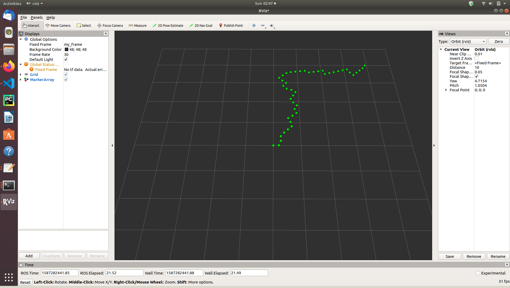

# ROS_Path_Planning
C++ path planning algorithms simulated and visualized with ROS/Rviz

Instructions
- Run roscore
- Create publisher node and publish to topic with (from ~/catkin_ws): $ rosrun ros_path_planning ros_rrt
- Open gazebo and view waypoints with (from ~/catkin_ws): $ rosrun rviz rviz -f my_frame

** Once Rviz window opens, the node visualization must be added by selecting 'Add' under th 'Displays' tab, then selecting 'MarkerArray'
Make sure the fix frame is set to 'my_frame'

